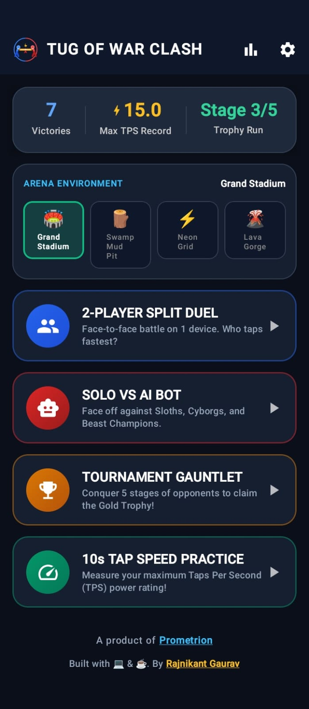
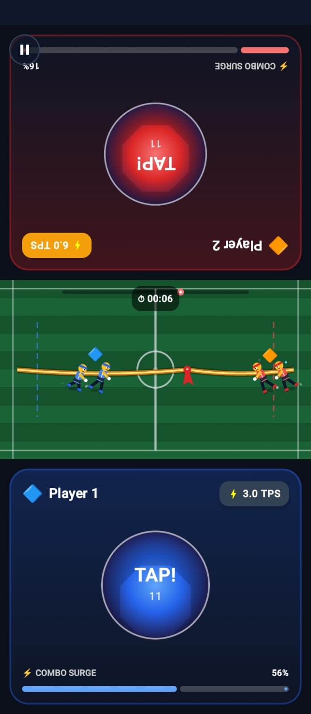
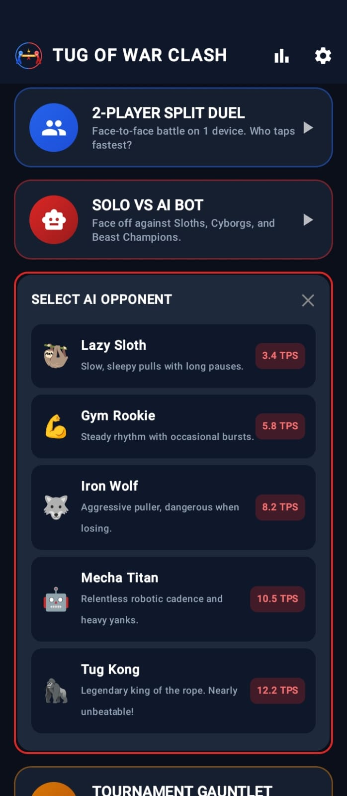
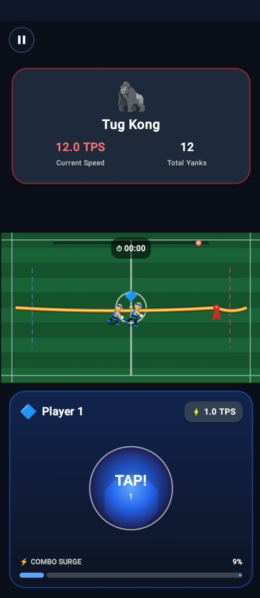
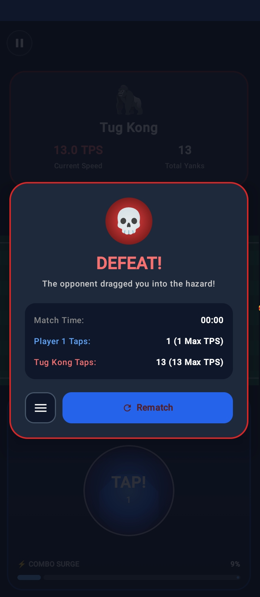
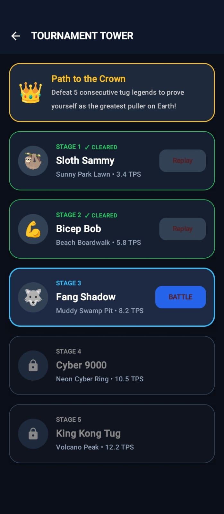
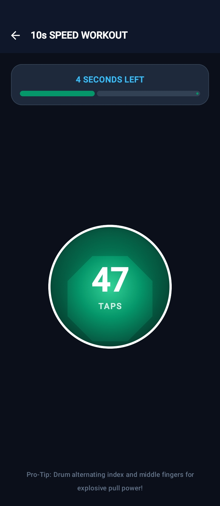
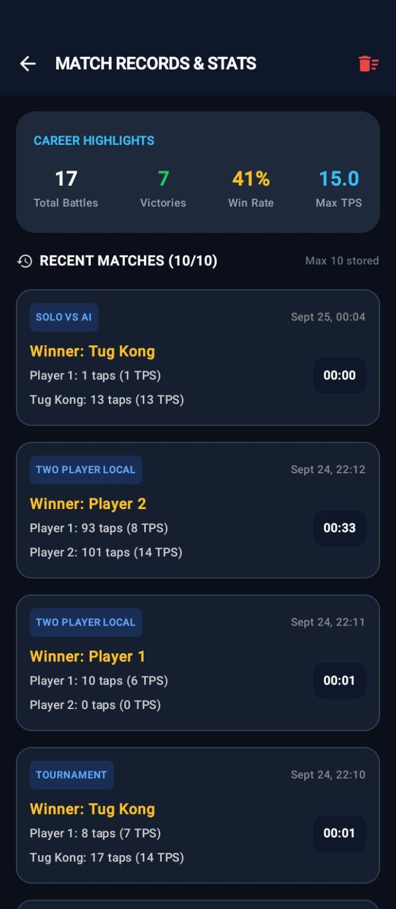
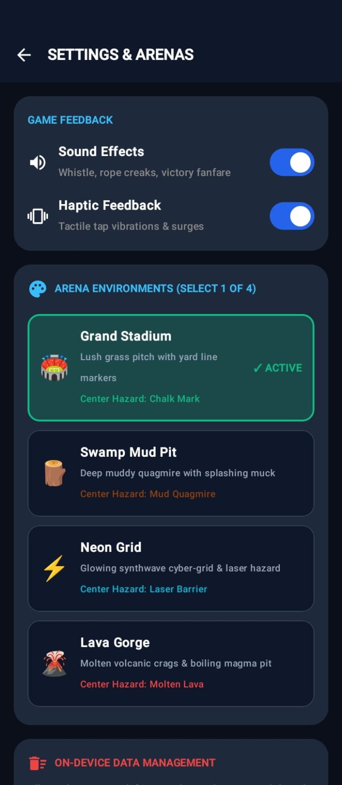
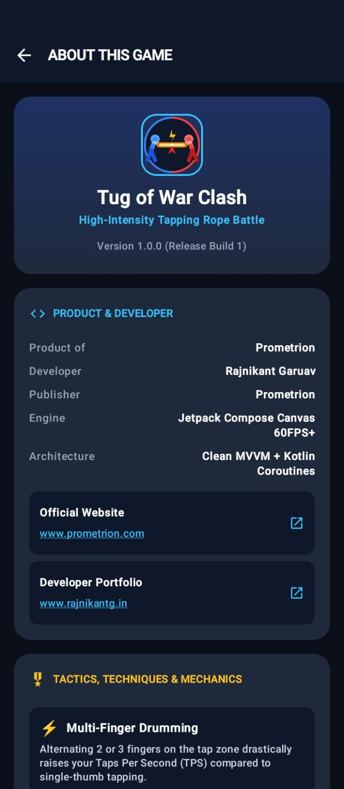

# Tug of War Clash

  <strong>High-Intensity Tapping Rope Battle</strong>

  A fast-paced Android tapping game where speed, timing, and tapping technique decide who controls the rope.

---

## 📱 Download & Installation

### 📥 Download the Latest APK

**[⬇️ Download Tug of War Clash v1.0.0](https://github.com/rajnikant357/Tug-Of-War-Clash/releases/download/v1.0.0.0/TugOfWarClash.apk)**

1. Open the download link above.
2. Download `TugOfWarClash.apk` on your Android device.
3. Open the downloaded APK.
4. If Android asks for permission, enable **Install unknown apps** for your browser or file manager.
5. Tap **Install**.
6. Launch **Tug of War Clash** and start playing.

> **Note:** This release is distributed through GitHub Releases and is not currently distributed through the Google Play Store.

**Version:** `1.0.0`  
**Release:** `Release Build 1`

---

## 🎮 About the Game

### Tug of War Clash
**High-Intensity Tapping Rope Battle**

Tug of War Clash is a fast-paced tapping game built around competitive tapping mechanics. Players battle by tapping as quickly and consistently as possible to pull the rope toward their side.

The game includes multiple ways to play, including local multiplayer, AI battles, tournament progression, and a dedicated tapping speed workout.

### Game Modes

- 👥 **2-Player Split Duel** — Face-to-face battle on one device.
- 🤖 **Solo vs AI Bot** — Challenge opponents with different tapping speeds and behaviors.
- 🏆 **Tournament Gauntlet** — Progress through five stages of increasingly difficult opponents.
- ⚡ **10s Tap Speed Practice** — Test your maximum tapping speed and measure your TPS.

---

## ✨ Features

- ⚔️ Fast-paced tapping-based rope battles
- 👥 Local 2-player multiplayer
- 🤖 Multiple AI opponents with different TPS levels
- 🏆 Five-stage tournament progression
- ⚡ Tap Speed Practice mode
- 📊 Match records and player statistics
- 📈 TPS — Taps Per Second tracking
- 🎯 Combo Surge mechanics
- 🌍 Multiple arena environments
- 🔊 Sound effects
- 📳 Haptic feedback
- 💾 On-device game data
- 🎨 Custom game environments
- 🏅 Victory and defeat result screens
- 📱 Designed for Android touch interaction

---

## 🖼️ Screenshots

### Home Screen

  

### 2-Player Split Duel

  

### AI Opponent Selection

  

### Solo vs AI Match

  

### Defeat Screen

  

### Tournament Tower

  

### 10s Speed Workout

  

### Match Records & Statistics

  

### Settings & Arena Environments

  

### About the Game

  

---

## 🧠 Tactics & Mechanics

### ⚡ Multi-Finger Drumming

Alternating two or three fingers on the tap zone can significantly increase your **Taps Per Second (TPS)** compared with single-thumb tapping.

### 🔥 Combo Surge

Consistent rapid tapping builds the Combo Surge meter, creating an additional gameplay mechanic around maintaining tapping momentum.

### 💪 TPS System

**TPS (Taps Per Second)** measures tapping speed and is used throughout the game for player statistics, AI difficulty, tournament opponents, and performance records.

---

## 🏟️ Arena Environments

The game features multiple environments, each with its own visual theme and center hazard:

| Arena | Environment | Center Hazard |
|---|---|---|
| 🏟️ Grand Stadium | Lush grass pitch | Chalk Mark |
| 🪵 Swamp Mud Pit | Deep muddy quagmire | Mud Quagmire |
| ⚡ Neon Grid | Synthwave cyber-grid | Laser Barrier |
| 🌋 Lava Gorge | Volcanic environment | Molten Lava |

---

## 🤖 AI Opponents

Solo mode includes opponents with different tapping characteristics:

| Opponent | TPS | Style |
|---|---:|---|
| 🦥 Lazy Sloth | 3.4 TPS | Slow pulls with long pauses |
| 💪 Gym Rookie | 5.8 TPS | Steady rhythm with occasional bursts |
| 🐺 Iron Wolf | 8.2 TPS | Aggressive pulling behavior |
| 🤖 Mecha Titan | 10.5 TPS | Relentless robotic cadence |
| 🦍 Tug Kong | 12.2 TPS | Legendary high-speed opponent |

---

## 🏆 Tournament Mode

The **Tournament Gauntlet** contains five progressive stages:

1. **Stage 1 — Sloth Sammy** — 3.4 TPS
2. **Stage 2 — Bicep Bob** — 5.8 TPS
3. **Stage 3 — Fang Shadow** — 8.2 TPS
4. **Stage 4 — Cyber 9000** — 10.5 TPS
5. **Stage 5 — King Kong Tug** — 12.2 TPS

Defeat opponents consecutively to progress toward the final stage.

---

## 🛠️ Product & Developer

| Detail | Information |
|---|---|
| **Product** | Prometrion |
| **Developer** | Rajnikant Garuav |
| **Publisher** | Prometrion |
| **Engine** | Jetpack Compose Canvas 60FPS+ |
| **Architecture** | Clean MVVM + Kotlin Coroutines |
| **Language** | Kotlin |
| **Platform** | Android |

---

## 🌐 Official Links

- **Prometrion:** [https://www.prometrion.com](https://www.prometrion.com)
- **Developer Portfolio:** [https://www.rajnikantg.in](https://www.rajnikantg.in)
- **Latest APK:** [Download TugOfWarClash.apk](https://github.com/rajnikant357/Tug-Of-War-Clash/releases/download/v1.0.0.0/TugOfWarClash.apk)

---

## 📦 Release Information

**Current Version:** `1.0.0`  
**Release Build:** `1`  
**APK:** `TugOfWarClash.apk`

---

## 👨‍💻 Developer

**Rajnikant Garuav**

Product and development by **Prometrion**.

---

  <strong>⚡ Tap Fast. Pull Hard. Conquer the Rope. ⚡</strong>

